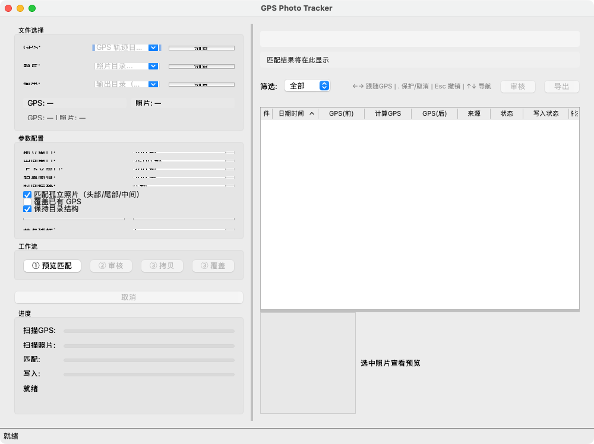

# GPS Photo Tracker

[](LICENSE)
[](tests/)
[]()
[]()
[]()

[中文文档](docs/README_zh.md)

Batch geotag photos using GPS tracks (GPX/KML/TCX/FIT) — automatically write EXIF GPS coordinates for camera photos without built-in GPS.



## Why This Tool

Most cameras (unlike phones and drones) don't record GPS. Without geotags, photo apps (Apple Photos, Lightroom, Google Photos) can't organize or recommend photos by location. Manual tagging is impractical for hundreds of photos.

**Typical workflow**: shoot with a camera, record GPS track on your phone or smartwatch (Apple Watch, Garmin, etc.), then use this tool to batch-match and geotag.

Existing tools with linear interpolation achieve **30-50% coverage** — many photos remain unmatched. GPS Photo Tracker adds a **two-pass neighbor-following** algorithm that recovers unmatched photos by following their nearest successful neighbor, boosting coverage to **~90%**. Parameters are adjustable to balance accuracy vs. coverage.

**Target users**: Travelers shooting with a camera + tracking GPS on phone/watch. Photographers needing location-based organization. Field researchers geotagging survey photos.

## Comparison with Other Tools

| Feature | GPS Photo Tracker | GeoSetter | HoudahGeo | Lightroom Classic | ExifTool | PicMeta PhotoTracker |
|---------|:-:|:-:|:-:|:-:|:-:|:-:|
| Price | **Free / OSS** | Free | $39 | $20/mo | Free | Free |
| Platform | Win/Mac/Linux | Win only | Mac only | Win/Mac | CLI (all) | Win only |
| Open source | **Yes (GPLv3)** | No | No | No | Yes (Artistic) | No |
| Chinese UI | **Yes** | Yes | No | Yes | Partial | No |
| GPS track formats | GPX<br>KML<br>TCX<br>FIT | GPX<br>NMEA<br>KML<br>+3 | GPX<br>NMEA<br>FIT<br>+1 | GPX | GPX<br>NMEA<br>KML<br>+3 | GPX |
| Linear interpolation | **Yes** | Yes | Yes | Yes | Yes | No |
| Two-pass neighbor follow | **Yes** | No | No | No | No | No |
| GPS coverage (typical) | **~90%** | ~50-70% | ~60-80% | ~50-70% | ~50-70% | ~30-40% |
| Interactive review | **Yes** | Limited | Yes | Limited | No (CLI) | No |
| Parameter tuning | **Yes** | Yes | Yes | Time offset only | Yes | Limited |
| WYSIWYG workflow | **Yes** | No | No | No | No | No |
| Arrow-key quick follow | **Yes** | No | No | No | No | No |
| Batch processing | **Yes** | Yes | Yes | Yes | Yes | Yes |
| Write status tracking | **Yes** | No | No | No | No | No |
| Last update | 2026 | 2019 | 2025 | 2026 | 2026 | 2022 |

> **Coverage**: All tools achieve high coverage with dense tracks (1 fix/sec). The gap widens with sparse tracks or GPS signal gaps — GPS Photo Tracker's neighbor following recovers photos that others leave unmatched.

## Features

### Core Matching

- **Multi-format GPS track support** — GPX, KML (Google Earth), TCX (Garmin), FIT (Garmin sport watches) with auto-detection
- **Linear interpolation matching** — Accurately interpolates positions between GPS track points
- **Two-pass neighbor following** — Unmatched photos follow nearest successful neighbor; existing-GPS photos excluded from propagation
- **Smart parameter tuning** — Auto-recommends parameters based on track density; all thresholds adjustable

### Interactive Workflow

- **WYSIWYG workflow** — Step-based guided flow: preview → review → execute. All edits carry forward to write
- **Interactive review** — Review failed GPS matches, manually assign coordinates or pick nearby track points
- **Arrow-key GPS follow** — Use ← → keys to quickly assign GPS from adjacent matched photos
- **Esc undo** — Press Esc to restore any photo to its original matched state
- **Source column context menu** — Double-click for quick access to follow/protect/undo actions
- **GPS overwrite protection** — Skips photos that already have GPS data by default
- **GPS coverage stats** — Real-time pre/post coverage rate and success rate display

### Safety & Performance

- **Safe copy mode** — Copies photos before writing, never modifies originals
- **Batch processing** — Handles thousands of photos with progress tracking and cancellation
- **Parallel write** — Multi-threaded EXIF writing for faster processing
- **Resume capability** — Checkpoint system for copy mode, can resume interrupted batches
- **EXIF orientation** — Correctly displays thumbnails with orientation transforms
- **Write status tracking** — Per-photo write status column (copied / overwritten / skipped / failed / cancelled)

### Export & Reporting

- **Result export** — Export to CSV or Markdown with auto-generated filename
- **HTML report** — Self-contained report with inline charts showing match results

## Roadmap

- **Mobile support (iOS/Android)** — Geotag photos directly on your phone, no computer needed. One device for both GPS tracking and photo processing.

## Quick Start

### Option A: Download Pre-built Package (Recommended)

Download from [GitHub Releases](../../releases) (latest: v0.24.1):

| Platform | File |
|----------|------|
| macOS | `GPS-Photo-Tracker-v0.24.1-macos.zip` |
| Windows | `GPS-Photo-Tracker-v0.24.1-windows.zip` |
| Linux | `GPS-Photo-Tracker-v0.24.1-linux.tar.gz` |

Download from [GitHub Releases](../../releases), unzip, and double-click to run. No Python or any other software needed.

### Option B: Run from Source

**Step 1 — Check Python version**

```bash
python --version
```

Need **Python 3.11 or higher**. If you see a lower version, download from [python.org](https://www.python.org/downloads/).

**Step 2 — Download source code**

```bash
git clone https://github.com/zwyin/gps-photo-tracker.git
cd gps-photo-tracker
```

**Step 3 — Install dependencies**

```bash
pip install -e .
```

This automatically installs all required packages: PySide6, piexif, gpxpy, geopy, tenacity.

**Step 4 — Launch**

```bash
python -m gps_photo_tracker
```

The program will automatically check dependencies on startup. If anything is missing, it shows a clear message telling you exactly what to install.

### Basic Workflow

The app uses a step-based guided workflow:

1. **① Preview** — Select GPS track and photo directories, auto-match photos to GPS positions
2. **② Review** — For unmatched photos, manually assign coordinates or pick nearby track points
3. **③ Execute** — Write GPS data to photos (copy to output or overwrite in-place)

What you see in the preview table is exactly what gets written — all manual corrections (arrow-key follows, review edits, resets) carry forward to execution.

### Data Safety

- Writing GPS metadata changes the file's modification time. If you need to preserve original timestamps, use **copy mode**.
- **Overwrite mode** replaces existing GPS metadata in the original files. Photos that already have GPS data are skipped by default, but if you enable "overwrite existing GPS", incorrect GPS data cannot be recovered once written. Image files themselves are never affected — only metadata changes.
- **Copy mode** is recommended: writes GPS to copies in a separate output folder, leaving originals untouched. Supports resume if interrupted.

## Development

### Setup

```bash
pip install -e ".[dev]"
```

### Run Tests

```bash
pytest                          # All tests
pytest --cov                    # With coverage report
pytest tests/unit/test_gps_matcher.py  # Single module
```

### Test Coverage

| Layer | Target | Current |
|-------|--------|---------|
| Core (algorithm/IO) | >= 90% | 100% |
| Service | >= 85% | 100% |
| GUI | >= 80% | 100% |
| Overall | >= 95% | 99.80% |

### Project Structure

```
src/gps_photo_tracker/
├── core/           # Algorithms: GPS matching, parsers, EXIF, checkpoint
├── service/        # Business logic: tagging pipeline, cancellation
├── gui/            # PySide6 GUI: main window, panels, dialogs
└── logging_/       # Structured logging
tests/
├── unit/           # 859 unit tests
├── integration/    # End-to-end tests
└── batch/          # Large-scale batch tests
```

## Configuration

Matching parameters can be adjusted in the GUI or programmatically:

| Parameter | Default | Range | Description |
|-----------|---------|-------|-------------|
| `isolated_window` | 300s | 60-3600 | Max time diff for isolated photos |
| `middle_time_window` | 3600s | 600-7200 | Max time diff for interpolated photos |
| `context_window` | 300s | 60-1800 | Window to determine interpolation eligibility |
| `max_gps_distance` | 200m | 50-1000 | Max distance between consecutive GPS points |
| `match_tail` | True | — | Match photos at track boundaries |
| `time_offset` | 0s | -3600~3600 | Camera clock correction |

### Parameter Guide

**`time_offset` — Camera clock correction**

Most common reason for matching failure. Your camera clock may differ from GPS time (wrong timezone, daylight saving, or simply inaccurate). Adjust this to compensate.

- Camera 5 minutes ahead → set to `-300` (subtract 5 min)
- Camera in wrong timezone (e.g. Japan UTC+9, GPS in UTC+8) → set to `3600` (add 1 hour)
- Unsure → leave at 0, check the preview; if all photos are unmatched, try adjusting in ±300s steps

**`isolated_window` — How far to reach for a GPS point**

When a photo has no nearby GPS points before or after it (e.g. GPS signal lost, or photo taken at track start/end), this controls how far back/forward to search for the nearest GPS point.

- Dense track (phone recording every second) → default 300s is fine
- Sparse track (smartwatch recording every 5-10 min) → increase to 600-900s
- Very sparse or GPS signal gaps during hiking → increase to 1800-3600s (accepts lower accuracy for more coverage)

**`middle_time_window` — Max gap for interpolation**

When a photo falls between two GPS points, the tool interpolates the position. This limits how far apart those two GPS points can be. Larger values = more photos matched, but less accurate.

- City walk with frequent GPS fixes → default 3600s (1 hour) is fine
- Long road trip with GPS gaps → increase to 7200s
- Want only high-accuracy matches → decrease to 600-1200s

**`context_window` — How close neighbors must be to count as "middle"**

Determines whether a photo is treated as "between neighbors" (eligible for interpolation) or "isolated" (uses nearest GPS point). A photo is "middle" only if both the previous and next photos are within this window.

- Continuous shooting (burst mode) → default 300s is fine
- Spaced out shooting (landscapes, every few minutes) → increase to 600s
- Very irregular intervals → leave at default; the isolated path will handle edge cases

**`max_gps_distance` — Prevent GPS jumps**

When interpolating, if the two GPS points are very far apart (e.g. flight between cities), the interpolated position is unreliable. This rejects interpolation when GPS points are too distant.

- Walking/hiking (slow movement) → default 200m is fine
- Driving or cycling → increase to 500m
- Want to be conservative → decrease to 100m

**`match_tail` — Match photos at track boundaries**

Whether to match photos taken before the GPS track started or after it ended, using the nearest track endpoint.

- Turn on (default) — photos at the beginning/end of your trip get matched to the first/last GPS point
- Turn off — strict matching only; useful when track boundaries are unreliable (e.g. GPS turned on late)

## Building

```bash
python scripts/build.py          # Build for current platform
python scripts/build.py --clean  # Clean build
```

Requires [PyInstaller](https://pyinstaller.org/). Produces a standalone `.app` (macOS), `.exe` (Windows), or binary (Linux).

## License

This project is licensed under the [GNU General Public License v3.0](LICENSE).

## Acknowledgments

- GPS matching algorithm validated against 1,832 real photos with 83%+ success rate
- Built with [PySide6](https://doc.qt.io/qtforpython-6/), [piexif](https://github.com/hMatoba/Piexif), [gpxpy](https://github.com/tkrajina/gpxpy), and [geopy](https://github.com/geopy/geopy)
